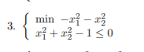
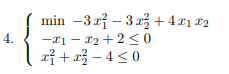
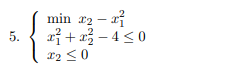
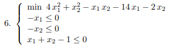
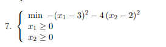
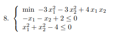
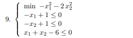

# Chapter 2

## Exercises on Nonlinear Optimization Theory

Answer the following questions for any of the nonlinear optimization problems reported below:

* a) Is it a convex optimization problem?

If the objective function is a quadratic function, then it needs a *positive semidefinite* (convex) or *positive definite* (strongly convex) Hessian. A quadratic function is defined as

$$f(x) = \frac{1}{2}x^T Qx+c^T x$$

* b) Do global optimal solutions exist? Why?
* c) Does the Abadie constraints qualification hold? Why?
* d) Find all the solutions of the KKT system associated with the problem.
* e) Find local and global optimal solutions exploiting the optimality conditions.
* f) Write the Lagrangian dual problem and try to solve it.

$$1. \left\{\begin{matrix} \text{minimize} & -x_{1}+x_{2}^2\\ \text{subject to} & -x_{1}^2-x_{2}^2+4 \leq 0 \end{matrix}\right.$$
[Exercise 1](Chapter_1_1.pdf)

$$2. \left\{\begin{matrix}
 \text{minimize} & -x_{1}^3+x_{2}^3\\ 
 \text{subject to} & -x_{1}-1 \leq 0\\
  & -x_{2}-1 \leq 0
\end{matrix}\right.$$
[Exercise 2](Chapter_1_2.pdf)

[Exercise 3](Chapter_1_3.pdf)

[Exercise 4](Chapter_1_4.pdf)

[Exercise 5](Chapter_1_5.pdf)

[Exercise 6](Chapter_1_6.pdf)

[Exercise 7](Chapter_1_7.pdf)

[Exercise 8](Chapter_1_8.pdf)

[Exercise 9](Chapter_1_9.pdf)