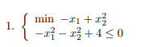
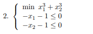

# Chapter 2

## Exercises on Nonlinear Optimization Theory

Answer the following questions for any of the nonlinear optimization problems reported below:

* a) Is it a convex optimization problem?

### Quadratic Function

If the objective function is a quadratic function, then it needs a *positive semidefinite* (convex) or *positive definite* (strongly convex) Hessian. A quadratic function is defined as

$$f(x) = \frac{1}{2}x^T Qx+c^T x$$

### Linear Function

If the objective function is a linear function, it is *convex* but not strongly convex.

* b) Do global optimal solutions exist? Why?
* c) Does the Abadie constraints qualification hold? Why?
* d) Find all the solutions of the KKT system associated with the problem.
* e) Find local and global optimal solutions exploiting the optimality conditions.
* f) Write the Lagrangian dual problem and try to solve it.

[Exercise 1](Chapter_2_1.pdf)

[Exercise 2](Chapter_2_2.pdf)

[Exercise 3](Chapter_2_3.pdf)

[Exercise 4](Chapter_2_4.pdf)

[Exercise 5](Chapter_2_5.pdf)

[Exercise 6](Chapter_2_6.pdf)

[Exercise 7](Chapter_2_7.pdf)

[Exercise 8](Chapter_2_8.pdf)

[Exercise 9](Chapter_2_9.pdf)